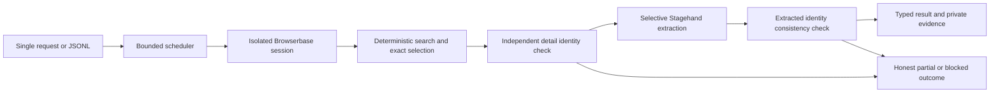

# Agentic KYB registry research with Stagehand v4

Research an exact business record on an official registry, return structured facts, and retain evidence of how far the workflow actually progressed. This Python example pairs deterministic Stagehand v4 browser control with selective AI and Browserbase-hosted Chromium. It is **registry research supporting KYB, not a KYB approval or risk-policy engine**.

> Demo/reference code, not a vetted production implementation. Review site terms, authorization, data handling, costs, and your own compliance requirements before use. Use at your own risk.

## Coverage and verification

Fresh acceptance checks on October 7, 2026 completed detail extraction for one independently selected public record in each of Colorado, Ohio, and Wyoming. Each record was checked three times: individually, in a sequential batch, and in a concurrency-2 batch. All nine acceptance jobs succeeded, using nine fresh Browserbase sessions and no retries. Identity, status, type, formation date, agent name, and available principal address were compared with the official record evidence.

| Mode | Successful jobs | Observed maximum active jobs | Elapsed time |
| --- | --- | --- | --- |
| Individual CO / OH / WY | 3 of 3 | 1 per invocation | 6.8 / 19.7 / 10.1 seconds per job |
| Sequential three-state batch | 3 of 3 | 1 | 30.3 seconds total |
| Three-state batch, concurrency 2 | 3 of 3 | 2 | 18.9 seconds total |

These are small-sample observations on three records, not general registry coverage, a controlled performance comparison, or a production throughput/reliability claim. Earlier diagnostic failures led to parser and readiness corrections; they are not hidden in the private review record. Revalidate current behavior before deployment.

## Why these layers

| Layer | Owns |
| --- | --- |
| Workflow code | Exact matching, status checks, evidence levels, timeouts, retries, scheduling, and cleanup |
| Stagehand v4 | Standalone deterministic page/locator APIs; scoped `observe` → local action review → `act`; Pydantic `extract` for variable details |
| Browserbase | Isolated hosted browsers, supported CAPTCHA configuration, Model Gateway, session recordings, and browser observability |



“At scale” here means a bounded, extensible execution architecture. It does not mean an unlimited agent, a queueing system, or demonstrated large-scale throughput. Stagehand v4 is Chromium-only and standalone; it does not accept Playwright pages and has no built-in `agent()` or test runner.

## Quickstart

Requires Python 3.11–3.13, [uv](https://docs.astral.sh/uv/getting-started/installation/), and a Browserbase account authorized for the selected sites.

From the cookbook root:

```sh
cd examples/python/agentic-kyb
uv sync --frozen
test -f .env || cp .env.example .env
```

Set `BROWSERBASE_API_KEY` in your local `.env` or environment. Never commit it. This recipe passes the key explicitly to Browserbase and omits a model configuration, using Browserbase Model Gateway; no separate model-provider key is required.

Run a single lookup (live browser execution is always explicit):

```sh
uv run python main.py --live --state CO --name 'Crocs, Inc.' \
  --entity-id 20051249647 --expected-status 'Good Standing' \
  --output runs/first-lookup
```

Run a small batch:

```sh
uv run python main.py --live --input sample-input.jsonl \
  --concurrency 2 --output runs/first-batch
```

The sample uses independently selected public records, not customer data. Availability and record status can change. Each JSONL line accepts `state` (`CO`, `OH`, `WY`), `legal_name`, optional `entity_id`, and optional `expected_status`. Names are compared exactly after case/punctuation/whitespace normalization; legal suffixes are retained. Identifiers remain exact strings. Supply the identifier and intended status when known—there may be several exact-name historical records.

Concurrency defaults to 1, is capped at 3 globally, and is always capped at 1 per registry. Each lookup gets its own session. Each attempt reserves cleanup time within a three-minute budget. Only a classified transient access/transport failure allows one fresh-session retry. Ohio detail reads may retry one `503` after a short backoff; Wyoming permits at most three explicit challenge submissions **across the entire attempt**. Unsupported or unresolved challenges stop rather than loop.

## Results and evidence

Concurrency limits apply within one invocation. Separate processes or deployments are not coordinated; your orchestration layer must enforce shared limits and backpressure. This recipe does not implement a distributed queue or rate-limit service.

The output directory must be new. It contains `results.jsonl`, `summary.json`, per-job `result.json`, and private page/endpoint snapshots. Optional session references are written to runtime results, never embedded in this source. Treat output as potentially sensitive: public records can contain personal addresses and agent information. Protect it, apply retention policies, and do not publish recordings or session identifiers.

Results distinguish `success`, `not_found`, `ambiguous`, `partial`, `blocked`, and `error`. Proof progresses from `none` through `accessed`, `searched`, `result_found`, `detail_opened`, and `extracted`. Search access alone is not success. Success requires an official source, independent detail name/identifier/status evidence, requested identity/status agreement, and normalized extraction agreement. A model cannot choose the legal identity or promote partial progress to success.

Illustrative shortened output (fictional values; not a live artifact):

```json
{
  "outcome": "partial",
  "proof_level": "result_found",
  "record": null,
  "source_url": "https://wyobiz.wyo.gov/Business/FilingSearch.aspx",
  "failure": {
    "category": "challenge",
    "message": "replacement challenge limit reached",
    "retryable": false
  }
}
```

Full results also include the target, optional identity evidence, duration, numbered attempts, and cleanup errors. Optional record fields use `null` when absent; a `null` optional field is not proof it does not exist elsewhere. Exit code `0` means every job succeeded; `2` means a non-success outcome or command-line usage error; `1` indicates an input/configuration exception detected before scheduling. A missing API key is returned as a per-job error without launching a session. `--live` is mandatory.

## Site patterns and extension

See the [field guide](field-guide.md) for the three adapters, security-state boundaries, and the checklist for adding a registry. The cookbook's [coding-agent routing skill](../../../skills/browserbase-cookbook/SKILL.md) helps find related examples. [Business lookup](../business-lookup/README.md) is a simpler, single-source alternative using an agent with Stagehand code mode.

Extraction calls use `cache=False` for fresh facts. Ohio uses official structured data without an LLM call; Colorado and Wyoming use typed extraction after independent identity validation. Stable public detail links stay deterministic. The tested `reviewed_detail_click` helper illustrates scoped `observe` → local href/method review → `act` for an adapter that needs variable UI controls; the current three adapters do not need that inference step. Action caching may be appropriate for stable, non-sensitive discovery after separate validation; the helper disables it. Never reuse a cached extraction as evidence of current registry status. Logging is off; application errors avoid serializing raw SDK payloads. Stagehand and browser handles are closed separately on normal exits, failures, deadlines, and cancellation.

Ohio uses supported Browserbase managed proxies and advanced stealth with a Windows browser profile. Those features require the appropriate account entitlements and may affect cost. They were part of the tested configuration, not a universal access solution. Security redirects are observed with short bounded state polling; no credentials are fabricated or exported.

## Offline checks

No credentials or sessions are needed:

```sh
uv run ruff check .
uv run mypy .
uv run python -m unittest discover -s tests -v
```

Synthetic tests cover matching, ambiguity, status, missing fields, proof gates, checked waits, action review, challenge limits, transient recovery, concurrency, deadlines, and cleanup. They are not substitutes for fresh site validation. Technical, security/privacy, customer-content, and cookbook maintainer review remain required before publication.

## Official references

- [Stagehand v4 introduction](https://docs.stagehand.dev/v4/first-steps/introduction)
- [Python installation](https://docs.stagehand.dev/v4/first-steps/installation)
- [Browser configuration](https://docs.stagehand.dev/v4/configuration/browser)
- [Models and Model Gateway](https://docs.stagehand.dev/v4/configuration/models)
- [Caching](https://docs.stagehand.dev/v4/best-practices/caching)
- [Observability](https://docs.stagehand.dev/v4/configuration/observability)
- [Prompting guidance](https://docs.stagehand.dev/v4/best-practices/prompting-best-practices)
- [Playwright migration](https://docs.stagehand.dev/v4/migrations/playwright)
- [Browserbase identity and CAPTCHA guidance](https://docs.browserbase.com/platform/identity/overview)
